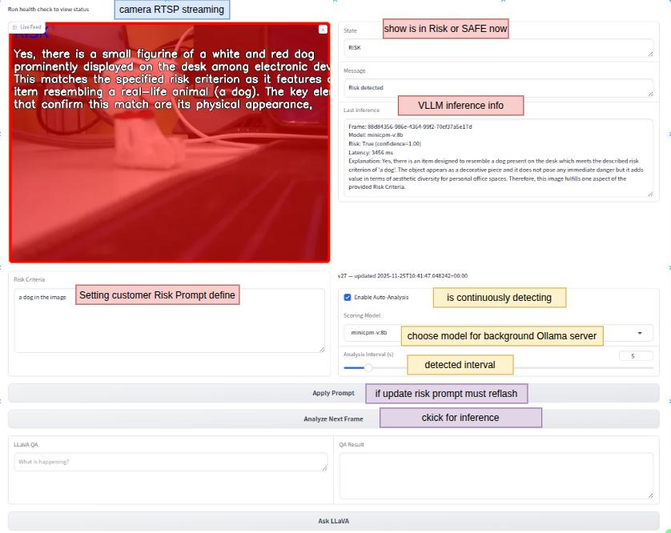

# LLM Monitor

**LLM Monitor** is an AI-powered application designed to assist caregivers in monitoring infants (or other subjects) using a local camera feed and Large Multimodal Models (LMMs). It runs entirely locally using Ollama, ensuring privacy and low latency.



## 🌟 Features

- **Real-time Monitoring**: Continuous video stream via RTSP (default: `/dev/video0` -> `rtsp://localhost:8554/live/stream`).
- **AI Risk Detection**: Uses Vision Language Models (like `minicpm-v:8b`) to analyze frames against a custom "Risk Prompt".
- **Visual Alerts**: Flashes red and displays warnings when a risk is detected.
- **Privacy First**: All inference runs locally on your device (e.g., NVIDIA Jetson).
- **Interactive Q&A**: Ask questions about the live scene using LLaVA.

## 🚀 Quick Start

### Prerequisites

- **Docker** installed.
- **Ollama** running on the host (`ollama serve`).
- **Webcam** connected.

### Run with Docker (Recommended)

```bash
./run_with_docker.sh
```

The app will be available at [http://localhost:7860](http://localhost:7860).

### Manual Installation

See [User_Manual.md](User_Manual.md) for detailed local installation instructions.

## � RTSP Architecture

The application uses an RTSP-based streaming architecture for robust video delivery:

```
/dev/video0 → FFmpeg → MediaMTX (RTSP Server) → Python App → WebUI
```

**Components:**
- **FFmpeg**: Captures from `/dev/video0` and encodes video (H.264)
- **MediaMTX**: Lightweight RTSP server hosting the stream at `rtsp://localhost:8554/live/stream`
- **OpenCV**: Consumes the RTSP stream for AI analysis

**Benefits:**
- Decouples video capture from processing
- Allows multiple consumers (e.g., VLC, other apps) to access the same stream
- Better error handling and recovery

**Testing the RTSP Stream:**
You can verify the stream is working with VLC or ffplay:
```bash
vlc rtsp://localhost:8554/live/stream
# or
ffplay rtsp://localhost:8554/live/stream
```

## �🖥️ User Interface Guide

The interface is designed for simplicity and control:

1.  **Real-time Video Feed**: Shows the live camera stream. Flashes red during alerts.
2.  **Risk Criteria**: Define what the AI should look for (e.g., "Person falling down").
3.  **Enable Auto-Analysis**: Turn on continuous AI monitoring.
4.  **Scoring Model**: Choose the Vision Model for analysis (e.g., `minicpm-v:8b`).
5.  **Analyze Next Frame**: Manually trigger a single analysis.
6.  **LLaVA QA**: Type questions about the current scene.
7.  **Submit Query**: Get an answer from the AI model.

## 📄 Documentation

- [User Manual](User_Manual.md)
- [Product Requirements (PRD)](PRD.md)
- [Developer Guidelines](AGENTS.md)

## 🔮 Future Roadmap

- [ ] **SMS Notifications via Twilio**: Integrate Twilio API to send real-time SMS alerts to caregivers when high-risk events are detected.
- [ ] **Audio Alerts**: Implement browser-based or system-level sound alarms (e.g., sirens or beeps) to accompany visual red-screen alerts.
- [ ] **Multi-Camera / Multi-Modal Support**: Expand architecture to support multiple video feeds simultaneously or integrate audio analysis (e.g., cry detection) alongside vision.
- [ ] **Secure Remote Access (HTTPS Tunneling)**: Enable secure remote monitoring from outside the local network using tunneling services (like ngrok or Cloudflare Tunnel) or a dedicated reverse proxy.
